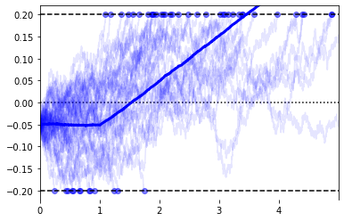
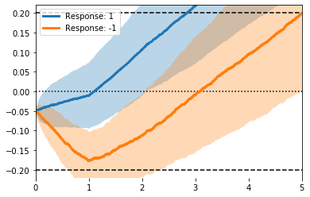
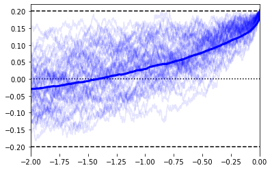
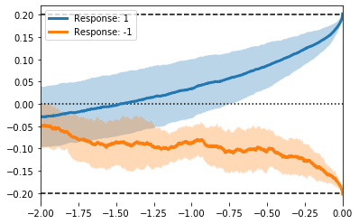

# Accumulate: Simulate Evidence Accumulation Models in Python

`Accumulate` is a python package for working with evidence accumulation models.

It provides

- Efficient functions for simulating data from a range of models.
- Classes that make it easier to tweak model parameters and manage simulated data.
- A consistent way to implement new models.
- Visualisation, including interactive widgets for Jupyter.
- Kernel density-based methods for estimating 
  the likelihood of real data under a given model/set of parameters,
  allowing parameter estimation and model comparision.

See [eointravers.com/code/accumulate/](http://eointravers.com/code/accumulate/) for documentation.


## Basic Use

```python
import pandas as pd
import numpy as np
import matplotlib.pyplot as plt
import os
import sys
import accumulate as accum
```

## Set up a model and provide parameters


```python
model = accum.models.Diffusion(pars=[1., .1, -.05, .2],
                               max_time=5., dt=.001)
model
```


    Classic Drift Diffusion Model
    Parameters: [t0 = 1.00, v = 0.10, z = -0.05, a = 0.20]


```python
model.describe_parameters()
```

    Parameters for Classic Drift Diffusion Model:
    - t0   : 1.00  ~ Non-decision time
    - v    : 0.10  ~ Drift rate
    - z    : -0.05 ~ Starting point
    - a    : 0.20  ~ Threshold (±)


## Simulate data


```python
%time X, responses, rts = model.do_dataset(n=1000)
```

    CPU times: user 630 ms, sys: 80.3 ms, total: 711 ms
    Wall time: 709 ms


```python
print(X.shape) # trials x time points
X.head()
```

    (1000, 5000)


<div>
<table border="1" class="dataframe">
  <thead>
    <tr style="text-align: right;">
      <th></th>
      <th>0.000</th>
      <th>0.001</th>
      <th>0.002</th>
      <th>0.003</th>
      <th>0.004</th>
      <th>0.005</th>
      <th>0.006</th>
      <th>0.007</th>
      <th>0.008</th>
      <th>0.009</th>
      <th>...</th>
      <th>4.990</th>
      <th>4.991</th>
      <th>4.992</th>
      <th>4.993</th>
      <th>4.994</th>
      <th>4.995</th>
      <th>4.996</th>
      <th>4.997</th>
      <th>4.998</th>
      <th>4.999</th>
    </tr>
    <tr>
      <th>sim</th>
      <th></th>
      <th></th>
      <th></th>
      <th></th>
      <th></th>
      <th></th>
      <th></th>
      <th></th>
      <th></th>
      <th></th>
      <th></th>
      <th></th>
      <th></th>
      <th></th>
      <th></th>
      <th></th>
      <th></th>
      <th></th>
      <th></th>
      <th></th>
      <th></th>
    </tr>
  </thead>
  <tbody>
    <tr>
      <th>0</th>
      <td>-0.053887</td>
      <td>-0.054587</td>
      <td>-0.056393</td>
      <td>-0.059097</td>
      <td>-0.052412</td>
      <td>-0.052823</td>
      <td>-0.054761</td>
      <td>-0.053152</td>
      <td>-0.055076</td>
      <td>-0.051574</td>
      <td>...</td>
      <td>0.241268</td>
      <td>0.241414</td>
      <td>0.240197</td>
      <td>0.240509</td>
      <td>0.239138</td>
      <td>0.243909</td>
      <td>0.245850</td>
      <td>0.250104</td>
      <td>0.248874</td>
      <td>0.249632</td>
    </tr>
    <tr>
      <th>1</th>
      <td>-0.047817</td>
      <td>-0.049691</td>
      <td>-0.051697</td>
      <td>-0.046471</td>
      <td>-0.042671</td>
      <td>-0.041830</td>
      <td>-0.041274</td>
      <td>-0.041914</td>
      <td>-0.043769</td>
      <td>-0.038682</td>
      <td>...</td>
      <td>-0.050676</td>
      <td>-0.048658</td>
      <td>-0.052083</td>
      <td>-0.052283</td>
      <td>-0.045055</td>
      <td>-0.044821</td>
      <td>-0.039403</td>
      <td>-0.045093</td>
      <td>-0.045052</td>
      <td>-0.052308</td>
    </tr>
    <tr>
      <th>2</th>
      <td>-0.045852</td>
      <td>-0.049106</td>
      <td>-0.048899</td>
      <td>-0.051315</td>
      <td>-0.056191</td>
      <td>-0.059246</td>
      <td>-0.060012</td>
      <td>-0.055809</td>
      <td>-0.054743</td>
      <td>-0.057204</td>
      <td>...</td>
      <td>-0.047869</td>
      <td>-0.050322</td>
      <td>-0.054172</td>
      <td>-0.052939</td>
      <td>-0.050586</td>
      <td>-0.045599</td>
      <td>-0.047502</td>
      <td>-0.047992</td>
      <td>-0.045825</td>
      <td>-0.045589</td>
    </tr>
    <tr>
      <th>3</th>
      <td>-0.052824</td>
      <td>-0.054225</td>
      <td>-0.054745</td>
      <td>-0.056600</td>
      <td>-0.062956</td>
      <td>-0.058086</td>
      <td>-0.054878</td>
      <td>-0.052510</td>
      <td>-0.049887</td>
      <td>-0.047209</td>
      <td>...</td>
      <td>0.602833</td>
      <td>0.605076</td>
      <td>0.610388</td>
      <td>0.615458</td>
      <td>0.619945</td>
      <td>0.615715</td>
      <td>0.618613</td>
      <td>0.614861</td>
      <td>0.613774</td>
      <td>0.614820</td>
    </tr>
    <tr>
      <th>4</th>
      <td>-0.043717</td>
      <td>-0.041635</td>
      <td>-0.038356</td>
      <td>-0.037765</td>
      <td>-0.035519</td>
      <td>-0.032939</td>
      <td>-0.034385</td>
      <td>-0.029513</td>
      <td>-0.031270</td>
      <td>-0.033759</td>
      <td>...</td>
      <td>0.709191</td>
      <td>0.708036</td>
      <td>0.712997</td>
      <td>0.715978</td>
      <td>0.716665</td>
      <td>0.716361</td>
      <td>0.716806</td>
      <td>0.720303</td>
      <td>0.720192</td>
      <td>0.722609</td>
    </tr>
  </tbody>
</table>
<p>5 rows × 5000 columns</p>
</div>


```python
print(responses[:5]) 
print(rts[:5])
```

    [-1. -1.  0.  1.  1.]
    [0.463 0.662   nan 2.184 1.096]


## Visualise

The `accumulate.viz` submodule contains a collection of `matplotlib`-based functions for visualising model simulations. Here are a few examples.


```python
ax = accum.viz.setup_ddm_plot(model) # Uses model info to draw bounds.
accum.viz.plot_trace_mean(model, X, ax=ax) # Plots simulations
```


```python
ax = accum.viz.setup_ddm_plot(model)
accum.viz.plot_traces(model, X, responses, rts, ax=ax, 
                      terminate=True, show_mean=True) # Show raw data
```





```python
ax = accum.viz.setup_ddm_plot(model)
for resp in [1, -1]:
    mask = (responses == resp) # Split by response
    accum.viz.plot_trace_mean(model, X[mask], ax=ax, label='Response: %i' % resp)
plt.legend()
```





```python
mX = accum.utils.lock_to_movement(X, rts, duration=2) # Time-lock to threshold crossing
ax = accum.viz.setup_ddm_plot(model, time_range=(-2, 0))
accum.viz.plot_traces(model, mX, responses, rts, ax=ax, show_mean=True)
```




```python
ax = accum.viz.setup_ddm_plot(model, time_range=(-2, 0))
for resp in [1, -1]:
    mask = responses == resp
    resp_mX = accum.utils.lock_to_movement(X[mask], rts[mask])
    accum.viz.plot_trace_mean(model, resp_mX, ax=ax, label='Response: %i' % resp)
plt.legend()
```





There are a small number of high-level functions that create multi-axis figures.


```python
accum.viz.visualise_ddm(model, model_type='ddm', measure='means');
```


## Interactive Visualisation

Using the `ipywidgets` package, we can wrap high level visualisation functions like `accum.viz.visualise_ddm` in a call to `ipywidgets` to make them interactive.

The interactive features will only work when you're running this notebook on your own computer.


```python
from ipywidgets import interact, FloatSlider
def fs(v, low, high, step, desc=''):
    return FloatSlider(value=v, min=low, max=high, step=step, description=desc, continuous_update=False)

def ddm_simulation_plot(t0=1., v=.5, z=0., a=.5):
    model = accum.Diffusion(pars=[t0, v, z, a])
    accum.viz.visualise_ddm(model, model_type='ddm', measure='raw')
    title = 't0 = %.1f, Drift = %.1f, Bias = %.1f, Threshod = %.1f' % (t0, v, z, a)
    plt.suptitle(title, y=1.01)

interact(ddm_simulation_plot,
         t0  = fs(1., 0, 2., .1,   't0'),
         v   = fs(.5, 0, 2., .1,   'Drift'),
         z   = fs(0., -1., 1., .1,  'Bias'),
         a     = fs(.5, 0., 2., .1,   'Threshold'));
```


# Other Models

The following model classes are currently available:

- Diffusion
- Wald
- HDiffision (Hierarchical Diffusion)
- HWald (Hierarchical Wald)
- Race

See the API for more details.

# Coming Soon

- Full API
- More models
- More visualisation tools
- Guide to implementing new models
